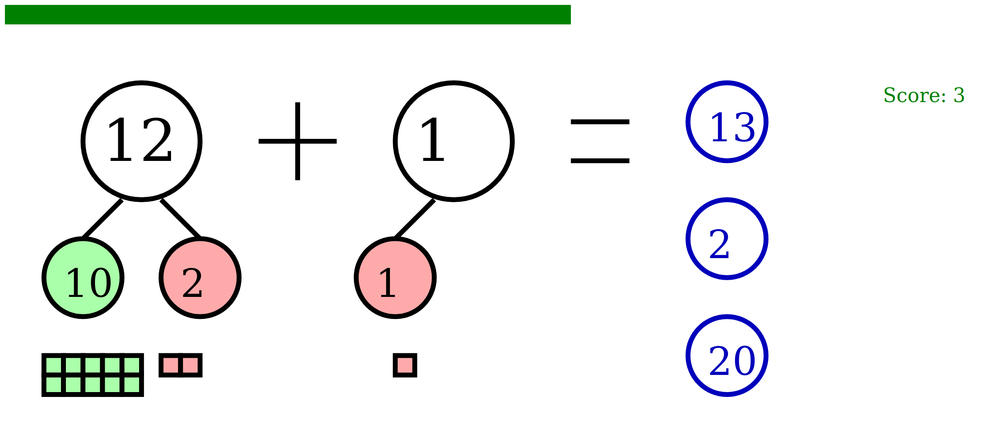

# bond
Practice adding and subtracting with number bonds.

Demo: **[math.nixy.io/bond](http://math.nixy.io/bond)**

## Gameplay

The player is presented with a randomly generated addition or subtraction problem, along with three possible answers.  If the player selects the correct answer, they are given 5 points and a new problem is generated.  If they select the wrong answer, they lose 1 point.  Once the player reaches 20 points in round, their score is increased by 1.  The player can ask for a free hint by clicking on the question mark.

### Contraints

* Problems do not exceed a sum of 20
* Problems do not include negative numbers (but they do include zero)
* Player can lose points in a round, but they cannot lose their score

### Hints

Addition hints are a break down (number bond) of the two numbers to "fill in the 10s", creating a smaller problem to solve.  For example, 8 + 6 becomes (8 + 2) + 4 which is 10 + 4.  The hint also includes a numberline representation of the same.

Subtraction hints break down the first number into the part that is cancelled out by the second number, and the remainder.  A numberline is also shown.

### Screenshot

